# 1. 预备计算机基础知识
## 1\.1 文件路径（地址）
### 什么是文件路径：
他是表示计算机文件存放位置的字符串，我们区分文件既需要文件名称，也需要文件路径。

我们在“此电脑”里面随便点开一个文件，上方都有一个地址栏，我们点击地址栏就会得到这个文件的路径。


例如：D:\software\qq 就是qq文件夹的文件路径，我们可以在该文件中找到软件相关的文件
在计算机学习和使用过程中应该养成文件分类放的良好计算机使用习惯，方便我们查找。
>如：分别创建应用软件文件夹和游戏文件夹，每次在安装后手动选择安装的路径。把QQ微信等 聊天记录保存地址在软件设置中改到其他盘符，避免占用C盘空间等。

这里推荐一个插件：Listary  [点击进入官网](https://www.listary.com/)

这些小插件基本不太占用内存，一般都是开机自启动
```
   双击键盘的ctrl按键即可快速弹出搜索框，搜索速度比windows快
```


## 1.2 常用文件类型（在文件管理器中可打开查看文件后缀，文件后缀区分文件类型）
1. 文本类文件
* .txt：纯文本文件，无格式，可通过记事本、文本编辑器直接打开，存储简单的字符内容。
* <span style="color:red;">.py：Python 源代码文件，存放 Python 程序代码，可通过 Python 解释器运行。</span>
* .java：Java 源代码文件，对应 Java 编程语言的代码文件。
* .c/.cpp：C/C++ 源代码文件，分别用于 C、C++ 程序开发。
* .html：超文本标记语言文件，构成网页的核心文件，描述网页结构。
* .json：轻量级数据交换格式文件，常用于接口数据传输、配置存储（键值对结构）。

2. 压缩类文件
* <span style="color:red;">.zip：最常用的压缩文件格式，可压缩多个文件 / 文件夹，跨平台兼容。</span>
* .rar：高压缩比的压缩格式，需专用软件（如 WinRAR）解压。
* .7z：高压缩率的开源压缩格式，压缩效率优于 zip/rar。

3. 可执行 / 安装类文件
* <span style="color:red;">.exe：Windows 系统下的可执行文件，双击可运行程序（如软件安装包、应用程序）。</span>

一、CMD 基础认知
&nbsp;&nbsp;&nbsp;&nbsp;CMD（Command Prompt）是 Windows 系统自带的命令行工具，通过文本指令完成操作，相比图形界面（GUI），能更高效地执行批量、重复任务，默认存放路径为 C:\Windows\System32\cmd.exe。
二、CMD 启动方式
1. 启动：打开文件管理器，定位到 C:\Windows\System32\，双击 cmd.exe 即可弹出 CMD 命令窗口；
2. 快捷键启动：按下 Win + R 打开「运行」窗口，输入 cmd 并回车（也可直接输入完整路径 C:\Windows\System32\cmd.exe），快速启动 CMD。

三、CMD 常用基础操作指令
1. 目录 / 文件导航类
cd [路径]：切换目录（Change Directory）
示例：
```
cd C:\software\qq      切换到 C 盘的 qq 文件夹；
cd /d D:\Software\Python   注意切换盘符要加 /d
特殊用法：
cd ..                  返回上一级目录
cd \                   回到当前磁盘根目录。
cls：清空 CMD 窗口内的所有指令和输出内容，让界面更整洁。
exit：关闭 CMD 命令窗口。
```
1. CMD 操作注意事项
* 指令不区分大小写（如 CD 和 cd 效果一致）；
* 路径中若包含空格，需用双引号包裹（如 cd "D:\Program Files"）；
* 执行删除、修改类指令时，确认路径和文件名无误，避免误删重要文件；
* 部分指令需要管理员权限：右键点击 CMD 快捷方式，选择「以管理员身份运行」，才能执行（如修改系统配置、安装软件等操作）。


2. cmd窗口讲解

>第一行：是Windows的版本信息
第二行：微软公司版权所有
第三行是cmd命令执行的文件路径。

我们所执行的文件操作类命令都在这个路径地址下执行，我们按需切换到目标路径（使用cd 路径）。当在cmd中输入一串命令，系统会优先搜索当前文件夹下的文件，当无法识别到目标文件，系统会改为搜索环境变量里面的文件，如果两个地方都没有找到，则会返回不能找到这个东西。由此可以看出，环境变量相当于一个指路人，当我们在所有的路径下都要使用某一个文件时，就可以将其路径添加到环境变量中，cmd就可以根据环境变量中的地址访问文件。

3. <span style="color:red;"> 在本次使用中，我们使用cmd来运行gti和conda的相关命令，所以git和conda在安装过程中要选择将路径添加到环境变量中。其他命令主要以图形化操作界面为主</span>


## 1.4 环境变量
### 境变量的核心理解
&nbsp;&nbsp;&nbsp;&nbsp; 我们在cmd中执行的命令时，计算机会优先搜索该地址文件或者说是在这个地址执行，然后再搜索环境变量中的程序，如果有需要在任何路径都可以被计算机执行的程序，那么将他的路径添加到环境变量中去。
&nbsp;&nbsp;&nbsp;&nbsp; 环境变量（Environment Variable）是操作系统中用来存储系统 / 程序运行所需配置信息的动态值，相当于操作系统或应用程序的 “全局参数”，能让程序在不同环境下灵活读取配置，无需硬编码到代码 / 程序中。
&nbsp;&nbsp;&nbsp;&nbsp; 简单类比：环境变量就像手机里的 “常用联系人快捷方式”—— 你不用记住联系人完整的手机号（对应具体路径 / 配置值），只需记住快捷名称（环境变量名），就能快速找到对方；操作系统 / 程序也一样，通过环境变量名就能调用对应的配置值，无需每次都写完整路径 / 参数。
### 环境变量的核心特点
* 全局性：设置后可被系统中所有程序、命令行工具（如 CMD）识别，无需重复配置；
* 动态性：可随时新增、修改、删除，修改后通常重启程序 / 命令行即可生效；
* 键值对结构：以「变量名 = 变量值」的形式存在（PATH=C:\Windows\System32），变量名通常大写（约定俗成），值可以是路径、字符串、数字等。
### 最常用的环境变量：PATH（重点） <span style="color:red;">注意：所有软件安装后如果移动软件或者文件夹位置和更改文件名称会导致windowss无法正确找到文件导致一些错误，解决方法是跟新路径或者重装软件。</span>
&nbsp;&nbsp;&nbsp;&nbsp; PATH 是操作系统最核心的环境变量，作用是告诉系统：当你在命令行输入一个指令（如cmd、python）时，该去哪些目录下找对应的可执行文件（.exe）。
举个例子：
&nbsp;&nbsp;&nbsp;&nbsp; 你在 CMD 中直接输入python就能运行 Python 解释器，本质是系统在 PATH 变量的所有路径中，找到了python.exe文件；如果没把 Python 的安装路径加入 PATH，输入python会提示 “不是内部或外部命令”，此时必须输入完整路径（如C:\Python310\python.exe）才能运行。
### 如何添加环境变量
#### 1.临时添加（仅当前 CMD 窗口有效，重启后失效）
适用于临时测试、单次使用的场景，无需修改系统配置。
操作指令：
cmd
>格式：set 环境变量名=原有值;新增路径
>示例：给PATH添加Python安装路径（注意：原有值保留，末尾加;再跟新路径）
>set PATH=%PATH%;C:\Python310

说明：%PATH% 代表 PATH 变量原本的所有值，; 是路径分隔符，新增路径需加在末尾；
验证：输入 echo %PATH% 可查看修改后的 PATH 值，输入对应程序（如 python）可直接运行。
#### 2. 永久添加（系统 / 用户级别，重启后仍生效）
##### 图形界面操作（新手推荐）
打开环境变量设置界面：
1. 右键「此电脑」→「属性」→「高级系统设置」→「环境变量」。
选择添加级别：
「用户变量」：仅当前登录用户生效（推荐，无需管理员权限）；
「系统变量」：所有用户生效（需管理员权限，谨慎修改）。
2. 编辑 PATH 变量（最常用）：在对应级别下找到「PATH」变量 → 点击「编辑」；
点击「新建」→ 输入要添加的路径（如C:\Python310）→ 点击「上移 / 下移」可调整优先级 → 「确定」保存。
1. 生效验证：
关闭所有已打开的 CMD 窗口（关键！旧窗口不会加载新环境变量）；
重新打开 CMD → 输入 echo %PATH%（或对应变量名），查看是否包含新增路径；
输入对应程序指令（如 python），验证是否可直接运
## 2.python环境配置
&nbsp;&nbsp;&nbsp;&nbsp; 我们要运行python就需要相应的平台，相当于我们在大学里才可以在你的大学里学习生活一样，或者执行.exe文件需要在windows中，我们要运行python就需要对应的解释器。
#### python解释器的分类
python解释器分为系统解释器、虚拟环境。
* 系统解释器全局唯一安装
* 虚拟环境则可以安装多个python解释器，不会对全局的系统解释器产生干扰。
由于虚拟环境可以创建很多个，我们就需要使用到conda对虚拟环境进行管理

根据学习需求，我们从官网上安装Miniconda即可完成学习需求
再安装时我们选择添加环境变量。
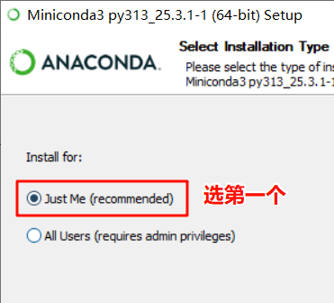
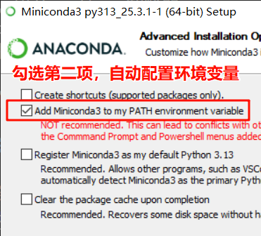
<span style="color:red;">完成后我们在cmd中输入conda --version可验证conda是否被正确安装,如果报错，大概率是因为环境变量没有添加，需找到anconda安装位置，将其添加到环境变量中。</span> 
如果出现了版本则可进入下一个操作
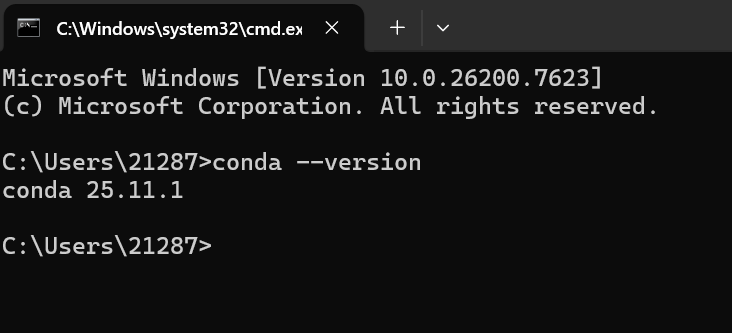
Conda 常用命令（需要记住）
```shell
# 查看版本号
conda --version
# 查看帮助信息
conda --help -h
# 查看环境列表
conda env list
# 创建环境
conda create --name <env_name> python=3.10
# 激活环境
conda activate <env_name>
# 退出环境
conda deactivate
# 删除环境
conda env remove --name <env_name>
# 安装软件包
conda install numpy
# 卸载软件包
conda uninstall <package_name>
```


## 3. 编辑器（提供处理文本格式等帮助）
1. 安装
推荐使用的编辑器是pycharm
[点击进入pycharm官网](https://www.jetbrains.com/zh-cn/pycharm/)

在开发者工具出找到python的开发编辑器，注册登录账号后就可以安装成功
<span style="color:red;">安装时勾选将文件夹打开为项目 </span>,目的是在windows注册表中添加右键快捷打开方式。

这时进入到文件管理中，通过鼠标右键点击空白处，显示更多，就会出现一个选项（open Folder as PyCharm Project）,点击则会在这个路径下打开pycharm。从此甚至可以不把快捷方式添加到桌面，也可以快捷打开Python文件夹。
进入pycharm中，我们需要把pycharm的终端地址改为windows的终端地址，也就是.exe的文件路径
设置步骤：
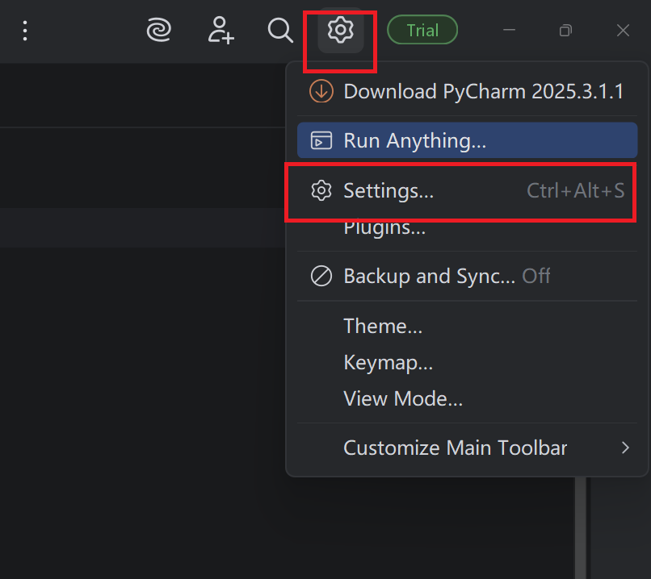
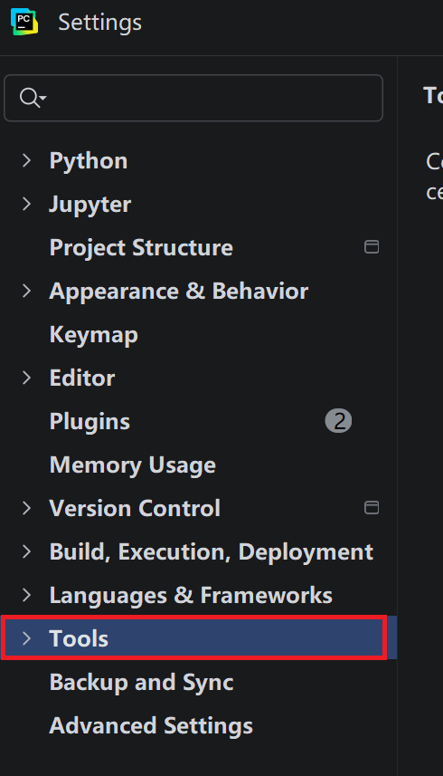
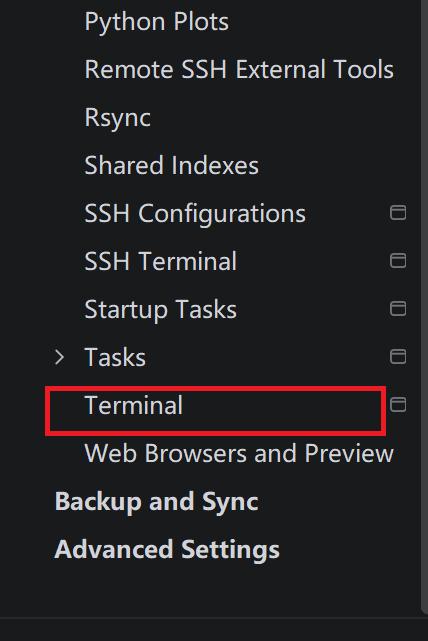
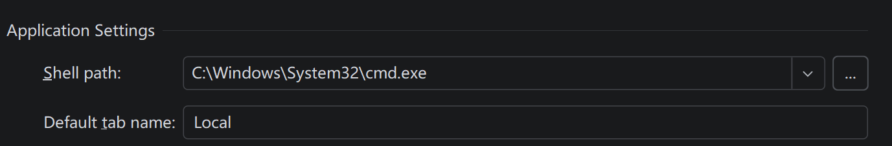
将Shell path的路径改为windows系统的cmd程序路径，这样在pycharm中终端调用系统的cmd程序，提高使用终端的稳定性。

### python解释器的创建与管理
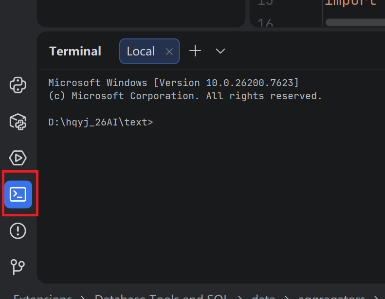
如图打开终端，由于在上面更换了Shell path的路径，所以这里打开的是windows的命令管理器(cmd),与直接打开cmd效果一致
```
格式： conda create --name <env_name> python=版本
在命令行窗口使用conda命令，创建一个python解释器
如  conda create --name test python=3.10
```
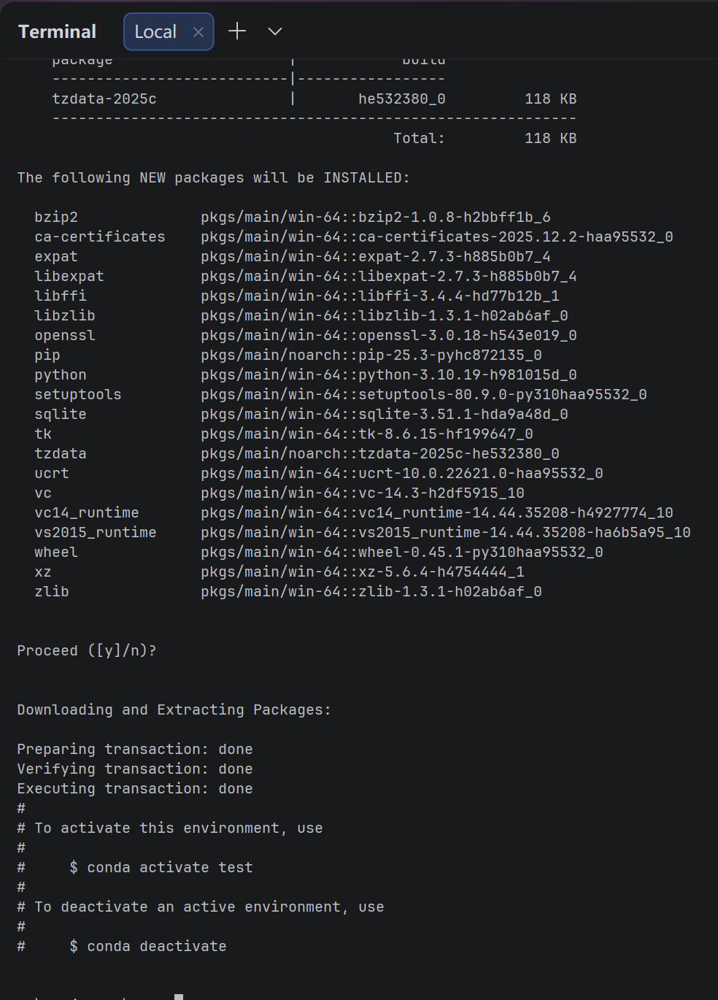
过程中需要按回车确认，结束后如图.

```
输入
conda env list   
```
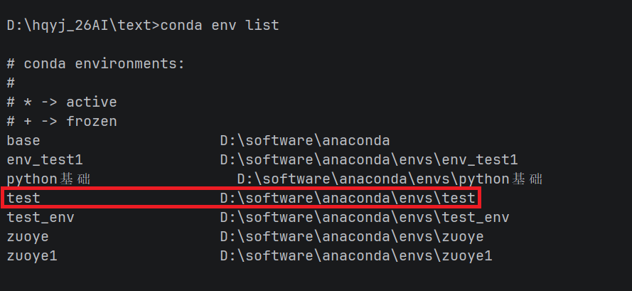
此时在列表展示中出现了刚才用conda create 创建的python环境名称。
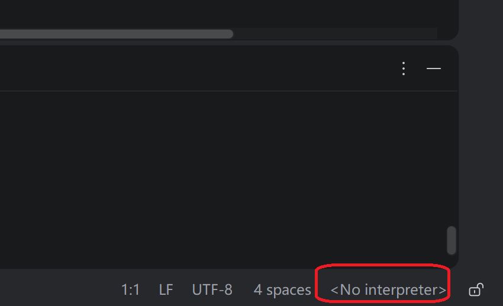
在pycharm的右下角，有一个图标\<No interpreter>,没有编译器，点击这个文字进行添加编译器。
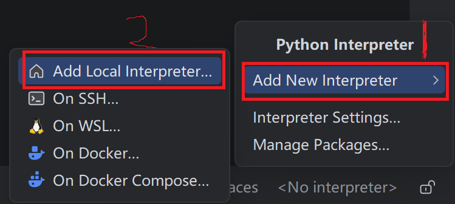

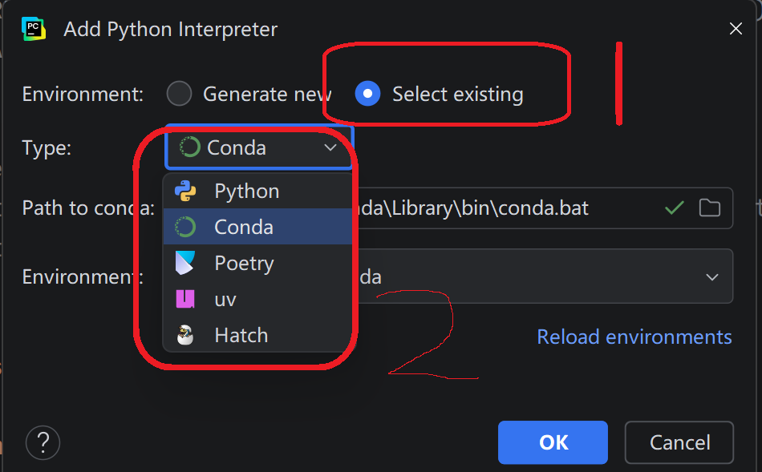
点击上方选择现有的解释器，然后选择conda的type

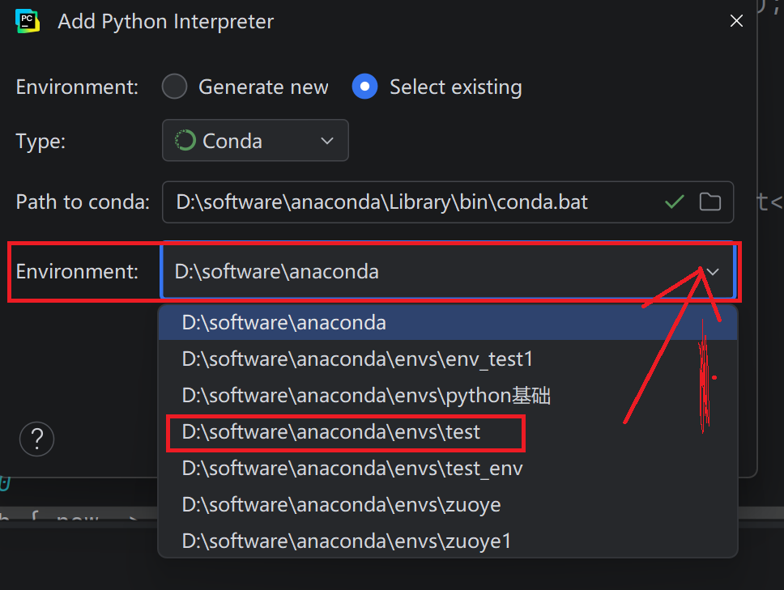
选择刚才创建的名称，选择OK等待加载完成，

1. 对比
另一个编辑器vscoda介绍
vscode是微软开发的轻量代码编辑器，生态丰富。


| 特性 | VSCode | PyCharm |
|:------:|:--------:|:---------:|
|体积和 启动速度 | 轻量、启动快|  重量级、启动稍慢|
|扩展性|极高（跨语言、跨场景）|主要聚焦 Python/Java 生态|
|新手友好度|需手动安装基础插件|配置简单，一站式 Python 开发	V|
|适用场景|全语言开发、轻量项目、快速编辑|大型 Python 项目、数据分析|

## 5. git
我们在书写代码时，当文件数量太多或者需要多人协同完成一个项目的时候，就需要git来帮我们管理代码
Git 是一款分布式版本控制系统（DVCS），由 Linus Torvalds 于 2005 年为管理 Linux 内核开发而设计，核心目标是高效、可靠地跟踪和管理代码（或文件）的版本变更，支持多人协同开发。
简单理解git,我们在steam上玩单机游戏时，游戏会有本地存档，我们可以进入以前的剧情玩耍，当我们退出时，所有的游戏数据又会上传到steam游戏服务器上，即便我们删掉电脑存档，只要服务器上的数据没有被删除，我们就可以从服务器上找回我们的游戏数据。git的任务就是帮助我们发送接受本地存储和服务器数据的管家

1. ### 常用git命令
学习地址：
https://www.runoob.com/git/git-workflow.html
#### 配置个人信息
用于提交数据时的身份识别
```
git config --global user.name "xxxx"
git config --global user.email "xxxxx@qq.com"
```

# 2. python基础
## 变量
Python 中的变量，本质上不是一个「装数据的盒子」，而是一个「指向 / 引用」。你可以把它理解成：变量是一个「标签」/「名字」，我们把这个标签「贴」在一块内存空间上，这块内存空间里存储着真正的数据（数字、字符串、列表等）。
基本语法：
变量名 = 值（这里的等号不是数学里的等号，而是赋值）
赋值运算规则是先执行赋值符号右边的量，然后在将计算好的量赋值到变量中去
变量名的使用规则：
* 硬性规定（python无法执行，会发生报错）：
1. 只能由字母数字下划线组成
2. 不能数字开头
3. 不能是Python的关键字
* 软性要求（可以执行，但为了可读性通用的规则）
1. 变量名要能表达具体的含义
2. 多单词组成的命名时用下划线命名：user_name
3. 变量名全部小写，不要使用驼峰命名法（userName），但遇到全部大写的变量名时，程序员尽量不要修改他的值。

python变量的一些特点：
1. 变量的类型，由它当前指向的数据的类型决定
2. 一个变量一次只能指向一个数据
3. 多个变量可指向同一个数据

交换值的用法：
```
a = 1
b = 0
a,b = b,a
print(a,b)--输出0 1
```
>使用type(变量名)可查看变量指向的数据类型
使用id(变量名)可查看变量指向的数据的内存地址（唯一标识）

## 数据类型
### 什么是数据类型?
&nbsp;&nbsp;&nbsp;&nbsp; 计算机的核心工作就是「处理数据」，我们要处理的数据五花八门：数字、字、真假判断、一系列数据、键值对信息...不同的数据，存储方式不一样、占用的内存大小不一样；不同的数据，能执行的操作也不一样（比如数字能加减乘除，文字不行）；Python 给所有数据做「分门别类」，就是为了方便存储、方便操作、提高效率，这个「类别」就是数据类型。
计算机可以表达不同类型的数据，例如: 数字、字符 等
&nbsp;&nbsp;&nbsp;&nbsp;Python 是一门纯面向对象的编程语言，所有的「数据类型」都有明确的「父子 / 继承」关系，就像自然界的物种分类：
界 → 门 → 纲 → 目 → 科 → 属 → 种。Python 里的类型分类也是这个逻辑，是一个从上到下的层级结构，而 object 就站在这个结构的最顶端。
* object = Python 的「根」，所有类型的「顶级父类」,可以使用 type(1).\__base\__ 来检测
* object 官方名称：根类 / 基类 / 顶层父类 (Base Class)
* 它是 Python 内置的一个「最基础的类型」；
* 所有你学过的、没学过的数据类型（int/str/float/bool/list/tuple/dict），全部都是 object 的子类；
* 所有的「对象」（比如10、"abc"），本质上都是 object 这个「祖宗」派生出来的「子孙对象」。
### 基本数据类型
1. #### bool
布尔值
布尔值（Boolean，也叫布尔类型），是专门用来表示「真」和「假」这两种对立逻辑状态的基础数据类型，没有第三种状态。
<span style="color:red;">注意（Python 重点）：Python 中这两个值是严格大小写敏感的，必须写成 True 和 False —— 首字母大写，其余小写，写 true/FALSE 都会报错！</span>在 Python 中，布尔类型（bool）是整数类型（int）的子类，布尔值本质上就是「披着布尔外衣的整数」：0和Flase在逻辑判断中会自动相互转化，非0数都是True.布尔值本身很少单独使用，它的唯一核心作用是：作为「判断的结果」，来控制程序的逻辑分支和循环执行，如:
```
if i==1:
   print(i)
   这里的==是比较符，如果i等于1，返回True,不等于1返回False
```
2. #### int
Python 中的整数类型，用来表示没有小数部分的数字，包含：
>正整数：1、5、100、2026
负整数：-1、-8、-99
零：0

重要特性：Python 的 int 和其他编程语言（Java/C++）的整数最大区别 —— Python 的整数没有取值范围限制，可以表示无限大 / 无限小的整数，不会出现「溢出」问题！

3. #### float
Python 中的浮点类型，专门用来表示带有小数部分的数字，包含：
>正浮点数：0.1、3.14、99.99
负浮点数：-2.5、-0.001、-100.0
特殊的「整数型浮点数」：5.0、-8.0（值等价于整数，但类型是float）

💡 和int的核心区别：int → 无小数位的纯整数；float → 有小数位的数值（哪怕小数位是 0）

4. #### complex
作用是：用于表示数学中的复数
表示方法
```
a = c + dj
a = complex(a,b),a为实部，b为虚部。
```

5. #### None
* None 是 Python 里的一个内置的特殊常量（关键字），它既不是数据类型，也不是变量，是一个「独一无二」的特殊值，有且只有这一个写法。
* None 的中文意思是：空、无、什么都没有、空值，专门用来表示「一个变量没有被赋值有效内容」「一个函数没有返回值」「某个位置为空」。
* None 的类型是 NoneType
* None 是 NoneType 这个类型的唯一实例 → 整个 Python 中，永远只有一个 None 对象，不存在第二个！
 
### 复杂数据类型（集）

1. #### 字符串 str （重点，必记）
定义：表示文本 / 字符序列，内容必须被引号包裹。
声明：三种定义方式，单引号'python' 、双引号"python" 、三引号'''多行字符串'''/"""..."""
```
name = '李华'
says = "今天天气真好"
about = """
      今天早上我吃了番茄炒蛋
      今天晚上我吃了米线
        """
```
转义字符：当需要输出引号时，如果按正常情况输入" 他的外号叫"法外狂徒"，他无恶不作 "，这时计算机就会从左边第一个引号开始，识别到第二个引号结束，"他的外号叫"后面的计算机无法识别，就会报错。所以在要输出引号时前面加入\"\\"，区分单独的引号。
" 他的外号叫\\"法外狂徒\\"，他无恶不作 "。

常见转义字符：常用核心转义字符：\n（换行）、\t（制表）、\\" \\'（引号）、\\\（反斜杠）。
使用乘法重复声明字符串：
```
print('+' * 50)
```

当字符串太长时，在字符串的末尾添加\\，这样python就会默认把他们连成一个字符串
```
s = '床前明月光，疑似地上霜。' \\
    '举头望明月，低头思故乡。'
```
 此处圆括号代表分组，在这个分组中有 4 段字符串，最终会拼接成一个字符串显示
```
s = (
    '床前明'
    'd思故'
    'a似地上b'
    'c望明月'
)
```
* 两段字符串用加号拼接用"+"
* 字符串可以通过索引取出，但是不能通过索引更改字符串。
* 字符串的相关操作（字符串的方法）

下面几个是字符串的方法，通过“.”点运算符取出class里面的函数
```
capitalize() 首字母大写
tittle() 每个字母首字符大写
lower() 所有字母小写
upper() 所有字母大写
strip() 去除空格
lstrip() 去除左边空格
rstrip() 去除右边空格
split() 分割字符串
splitlines() 按行分割字符串
jion() 连接字符串
endwith() 判断字符串以什么结尾
startwith() 判断字符串以什么开头
isdigit() 判断是否是数字
isnumeric() 是否是阿拉伯或其他数字
isdecimal()是否是十进制数字
```

格式化字符串
print(f"You are {'logged in' if is_logged_in else 'not logged in'}.")
用{}里加入if 判断语句进行选择输出

* 核心特性：
① 严格区分大小写 (A≠a) 
② 不可变（创建后内容不能修改，所有修改都是生成新字符串）
③ 有序序列（有索引）
* 核心操作：支持索引 / 切片(如'abc'[0]、'abc'[::-1])、成员运算in/not in
* 真假判定：空字符串'' → False；所有非空字符串（包括'0'、' '、'False'）→ True
* 高频用法：拼接+、重复*、格式化（f-string 首选）、内置方法 (strip()去空格 /replace()替换 /split()分割等）

2. #### 列表 list （重点，可变容器）
定义：Python最常用的可变有序容器，用中括号定义
```
 lst = [1, 'a', True, [2,3]]
```
* 核心特性：
① 有序（有索引，支持下标取值）
② 可变（可增 / 删 / 改 / 查，直接修改原列表）
③ 可存储任意数据类型（数字、字符串、布尔、容器、对象都可以）
④ 允许重复元素
* 核心操作：索引取值lst[0]、切片lst[1:3]、增append()/insert()、删del/pop()、改lst[0]=100
* 真假判定：空列表[] → False；非空列表 → True

3. #### 元组 tuple （重点，不可变容器）
定义：
```
tup = (1, 'a', True)
空元组：a = tuple()

```
* 核心特性：
① 有序（有索引，支持下标取值 / 切片）
② 不可变（创建后内容永远不能增删改，是只读容器）
③ 可存储任意数据类型 ④ 允许重复元素
<span style="color:red;">特殊点：单个元素的元组必须加逗号 (10,)，否则只是普通括号运算</span>
* 核心场景：存储「不允许被修改」的数据，比如配置项、固定常量，比列表更安全
* 真假判定：空元组() → False；非空元组 → True

4. 集合 set （高频，无序去重容器）
定义：Python无序、无索引、去重容器
```
s = {1,2,3}
空集合必须写set()（{}是空字典）
```
* 核心特性：
① 无序（无索引，不能用下标取值）
② 自动去重（集合内永远无重复元素）
③ 只存储不可变数据（int/str/bool/tuple，不能存 list/dict/set）
* 核心操作：集合运算（交集&、并集|、差集-）、增add()、删remove()
* 核心场景：快速去重、数据交集 / 并集判断（比如找两个列表的共同元素）
* 真假判定：空集合set() → False；非空集合 → True

5. #### 字典 dict （重点，键值对映射容器）
定义：Python无序键值对容器
```
dic = {'name':'张三', 'age':18}
键值对格式key:value
```
* 核心特性：
① 存储的是「键：值」映射关系，通过键取值，而非索引 
② 键 (key)：必须是「不可变类型」(int/str/tuple)、唯一不重复 
③ 值 (value)：任意数据类型、可重复 ④ 3.7 + 版本字典有序，3.6 及以下无序
* 核心操作：取值dic['name']/dic.get('name')、新增dic['sex']='男'、修改dic['age']=20、删除del dic['name']
* 核心场景：存储有对应关系的数据（比如用户信息、配置信息），开发中使用频率极高
*  真假判定：空字典{} → False；非空字典 → True

6. #### 范围 range （实用，数字序列生成器）
定义：Python内置的数字序列生成器，用于生成「连续的整数序列」
```
语法固定：range(start, stop, step)
```
>三个参数规则：
start：起始值，默认0；
stop：结束值，必填，生成的序列不包含结束值（左闭右开）；
step：步长，默认1，可以是正数 / 负数；
常用写法：
range(5) → 生成 0,1,2,3,4
range(1,6) → 生成 1,2,3,4,5
range(1,10,2) → 生成 1,3,5,7,9

* 核心特性：① 生成的是「序列对象」，不是列表，可通过list(range())转列表 ② 节省内存，按需生成数字 ③ 只能生成整数
* 核心场景：循环遍历（for 循环指定次数必用）

#### 7. decimal 模块 （高精度小数，解决浮点精度问题）
* 作用：专门解决 Python 中 float 浮点型的精度误差问题（如0.1+0.2≠0.3的坑）
* 核心原因：float 是二进制存储，部分十进制小数（0.1/0.2）无法精确表示，decimal 是十进制高精度计算，无误差
* 使用规则：① 导入模块 from decimal import Decimal ② 传入字符串格式的数字（不要传 float）
```
示例：Decimal("0.1") + Decimal("0.2") = Decimal("0.3") 精准无误差
```
* 适用场景：金融计算、金额结算、科学计算等对精度要求极高的场景（日常简单计算用round()即可）


### 转义字符 （必记常用，清晰无冗余）
#### 定义
转义字符：以反斜杠 \ 开头的特殊字符，用来表示「字符串中无法直接书写 / 显示」的字符，\ 本身不显示，只用来修饰后面的字符
```
必记高频转义字符（全部常用，记这些足够）
\n ：换行符 → 光标换行到下一行开头
\t ：制表符 → 相当于键盘的 Tab 键，空 4 个空格位
\\ ：表示一个普通的反斜杠 → 解决\被识别为转义符的问题
\' ：表示一个普通的单引号 → 用于单引号包裹的字符串内写单引号
\" ：表示一个普通的双引号 → 用于双引号包裹的字符串内写双引号
```
#### 取消转义（实用技巧）
在字符串最前面加字母 r ，表示「原始字符串」，所有转义字符失效，原样输出
```
示例：print(r'hello\npython') → 输出：hello\npython （\n 不再换行）
```
* 场景：写文件路径、正则表达式时必用


### 类型转换 （全类型完整版，核心必考，分两类整理）
#### 核心原则
Python 类型转换分为 自动隐式转换（解释器自动做，如True+1）和 手动显式转换（用内置函数，开发常用）
所有转换函数都是 Python 内置函数，直接调用即可
```
语法：转换函数(待转换数据)
转换的前提是「数据有意义」，比如int('abc')会报错，无法转换
```
#### 一、基础类型互转（必记，全部高频）
1. 布尔值转换：bool(x)
```
转False的情况（固定 9 种）：False、0、0.0、''、[]、()、{}、set()、None
转True的情况：除以上 9 种，其余所有数据全部为 True（如-1、'0'、[False]）
```
2. 整数转换：int(x)
```
可转：纯整数字符串、float（截断小数，不四舍五入）、bool（True→1/False→0）
示例：int('123')=123、int(3.99)=3、int(False)=0
不可转：含字母 / 小数点的字符串、None
```
3. 浮点转换：float(x)
```
可转：纯数字字符串、int、bool（True→1.0/False→0.0）
示例：float('3.14')=3.14、float(5)=5.0
不可转：含非数字的字符串、None
```
4. 字符串转换：str(x) 【万能转换】
可转：Python 中所有数据类型（int/float/bool/list/tuple/dict/set/range/None/decimal）
规则：原样转为「字面量文本」，无任何报错情况
```
示例：str(123)='123'、str([1,2])='[1, 2]'、str(None)='None'
```
#### 二、容器类型互转
```
列表转元组：tuple(list) → tuple([1,2])=(1,2)
元组转列表：list(tuple) → list((1,2))=[1,2]
列表 / 元组转集合（自动去重）：set(list) → set([1,1,2])={1,2}
范围转列表：list(range(5))=[0,1,2,3,4]
```
#### 三、特殊转换补充
```
复数转换：complex(x) → 可转 int/float/bool，转后虚部为 0，如complex(2)=(2+0j)
高精度转换：Decimal(x) → 传入字符串，如Decimal("0.1")
```
#### 四、Dunder 变量（魔术变量 / 魔法属性）
1. 定义
Dunder = Double Underscore → 双下划线变量，也叫「魔术变量 / 魔法属性」，Python 内置的、以__开头 + __结尾的特殊变量 / 属性
1. 核心特点
* 不需要手动定义，Python 自动为所有对象（变量、函数、类）生成
* 全部是系统内置，有固定含义和作用，不能随便修改
* 命名规范：前后都是两个下划线，如__name__，不是一个 / 三个
1. 必记高频 Dunder 变量（开发 / 面试最常用，记这些足够）
```
\__name__ ：程序入口标识
作用：判断当前脚本是「被直接运行」还是「被导入为模块」
规则：直接运行脚本 → __name__ == '__main__'；被导入 → __name__ == 模块名
必写用法：
python
if __name__ == '__main__':
只有直接运行时才执行的代码
print('程序执行')
```

```
__doc__ ：获取对象的文档注释
示例：print(list.__doc__) → 
打印列表的官方文档注释；自定义函数写的注释也能通过它获取

__file__ ：获取当前脚本的绝对文件路径（只有脚本文件有效，交互模式无）
__len__ ：对应len()函数，调用len(obj)本质就是执行obj.__len__()
补充：还有魔术方法（双下划线方法），如__init__（初始化）、__str__（打印对象），
属于魔术变量的延伸，也是高频考点
```
#### 五、运算符 （完整版，全分类、易理解，无遗漏） ✅ 你的指定项
>说明：Python 所有运算符全整理，按「优先级 + 使用频率」排序，分类清晰，每个都有说明，一看就懂
1. 算术运算符 （最常用，处理数学计算）
+ 加法
```
  （数值相加、字符串拼接、列表拼接）→ 1+2=3、'a'+'b'='ab'- ：
```
+ 减法 
```
   5-3=2* ：
```
+ 乘法（数值相乘、字符串 / 列表重复）→ 
```
  3*4=12、'a'*3='aaa'/ ：
```
+ 除法
```
   →结果永远是float → 5/2=2.5// ：
```
+  整除
```   
   （向下取整，只保留整数位）→ 5//2=2、-5//2=-3% ：
```
+  取余（求余数）→
```
    5%2=1、6%3=0 【高频：判断奇偶、循环周期】** ：
```
+   幂运算（次方）→ 
```
    2**3=8（2 的 3 次方）、9**0.5=3（开平方）
```

2. 赋值运算符 （最常用，给变量赋值）
```
a = 10  # 基础赋值：a=10
a += 3  # a = 10+3 → 13
a -= 2  # a = 13-2 → 11
a *= 4  # a = 11*4 → 44
a /= 2  # a = 44/2 → 22.0（注意：结果是浮点数）
a //= 3 # a = 22.0//3 → 7.0（整除，保留浮点数形式）
a %= 5  # a = 7.0%5 → 2.0（取余：7除以5余2）
a **= 3 # a = 2.0**3 → 8.0（立方：2×2×2）
```
3. 比较运算符 （判断条件，返回布尔值 True/False）
* ==：等于 → 判断两个值是否相等 
```  
10==10 → True
"abc"=="abc" → True
```
* !=：不等于 → 判断两个值是否不等 
```
10!=5 → True
1!=False → True
```
* \>：大于 → 比较数值 / 字符串大小（字符串按逐字符 ASCII 码）
```
10>5 → True
"b">"a" → True
```
* <：小于 → 比较数值 / 字符串大小（字符串按逐字符 ASCII 码）
```
10<5 → False
"2"<"10" → False
```
* \>=：大于等于 → 数值 / 字符串「大于或等于」
```
10>=10 → True
5>=3 → True
```
* <=：小于等于 → 数值 / 字符串「小于或等于」
```
10<=5 → False
3<=3 → True
```
* is：判断「是否是同一个对象」（比较内存地址是否相同）
```
a=None; a is None → True
b=10; c=10; b is c → True
```
* is not：判断「不是同一个对象」（比较内存地址是否不同）
```
a=[1]; b=[1]; a is not b → True
a=1; a is not None → True
```

4. 逻辑运算符 （组合条件，返回布尔值，高频）
作用：把多个比较条件组合起来，做复合判断，优先级：not > and > or
* and ：逻辑与 → 所有条件都成立，结果才是 True；有一个 False 则整体 False
* or ：逻辑或 → 只要有一个条件成立，结果就是 True；全 False 才是 False
* not ：逻辑非 → 取反，True 变 False，False 变 True → not True → False
```
示例：
10>5 and 3<8 → True 
10>5 or 3>8 → True 
not (10>5) → False
```

5. 成员运算符 （判断元素是否在容器中，返回布尔值，高频）
* in ：判断「元素是否存在于容器中」
```
 'a' in 'abc' → True 、 1 in [1,2] → True
```
* not in ：判断「元素是否不存在于容器中」
```
  'x' * not in 'abc' → True
```
> 适用类型：str、list、tuple、set、dict（dict 判断的是键）

6. 身份运算符
就是上面的 is 和 is not，专门判断对象的身份（内存地址），常用来判断None：x is None
1. 位运算符（了解即可，用的少）
基于二进制计算，开发中用的不多，简单记：&（按位与）、|（按位或）、^（按位异或）、~（按位取反）、<<（左移）、>>（右移）


大纲
hello_world
变量
数据类型
数据类型
字符串
转义字符
集合
类型转换
Dunder变量
运算符
输入输出
if条件判断
while循环
for循环
循环控制关键字
函数
lambda表达式
常用内置函数
assert
参数的值传递和引用传递
变量作用域
异常与异常处理
eval和exec
面向对象
内置库
时间
time
datetime
文件读写
os
random
math
json
sys
request

